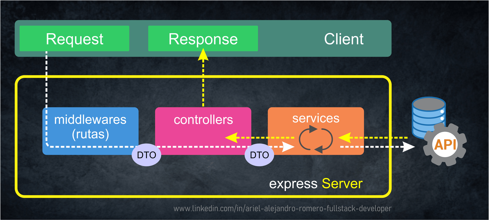

# 🎯DTO

[Volver a Inicio](../../README.md)

- DTO es el acrónimo de "Data Transfer Object" (Objeto de Transferencia de Datos).
- Es un patrón de diseño utilizado en el desarrollo de software para transferir datos entre diferentes capas de una aplicación.
- Los DTOs son objetos simples que no contienen lógica de negocio sino únicamente datos.
- Su propósito principal es transportar datos de un lugar a otro de manera eficiente y estructurada.

## Características de un DTO

1. **Simplicidad**: Un DTO solo contiene campos y sus respectivos métodos de acceso (getters y setters). No incluye lógica de negocio.
2. **Inmutabilidad (opcional)**: En algunos casos, los DTOs se diseñan como objetos inmutables, lo que significa que sus valores no pueden cambiar una vez que se han asignado.
3. **Eficiencia**: Están diseñados para ser livianos y transportar solo la cantidad mínima de datos necesarios.

## Usos Comunes de los DTOs

1. **Transferencia de Datos entre Capas**: Los DTOs se utilizan a menudo para transferir datos entre la capa de presentación (por ejemplo, una interfaz de usuario) y la capa de negocio, o entre la capa de negocio y la capa de acceso a datos.
2. **Intercambio de Datos entre Servicios**: En aplicaciones distribuidas, los DTOs se utilizan para intercambiar datos entre servicios a través de una red.
3. **Reducción de Dependencias**: Los DTOs ayudan a reducir las dependencias entre las diferentes capas de una aplicación, promoviendo una arquitectura más modular y fácil de mantener.

[Volver a Inicio](../../README.md)