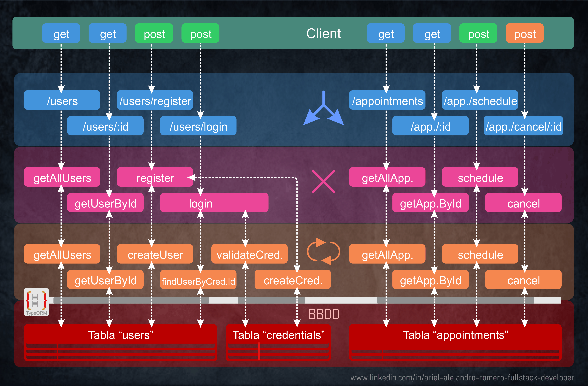

# 📚 FLOW GENERAL DEL PROYECTO

[Volver a Inicio](../../README.md)

---

<br/>

```txt
Client ---> Request
    ↑          ↓
    |       Middlewares / Rutas
    |          ↓
    └------ Controllers  (manejo de request y errores)
              ↓  ↑
            Services     (lógica de negocio)
              ↓  ↑
            Repositories (acceso a base de datos)
```

<br/>

---

<br/>



---

<br/>

[Volver a Inicio](../../README.md)
