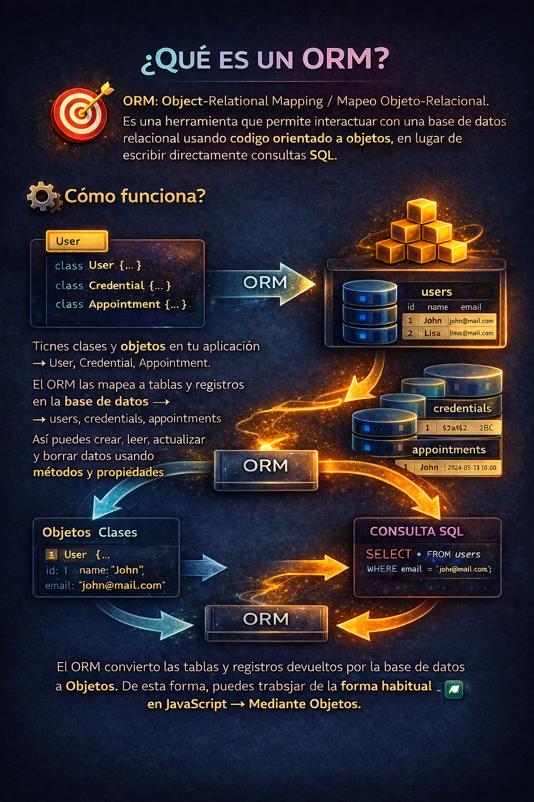
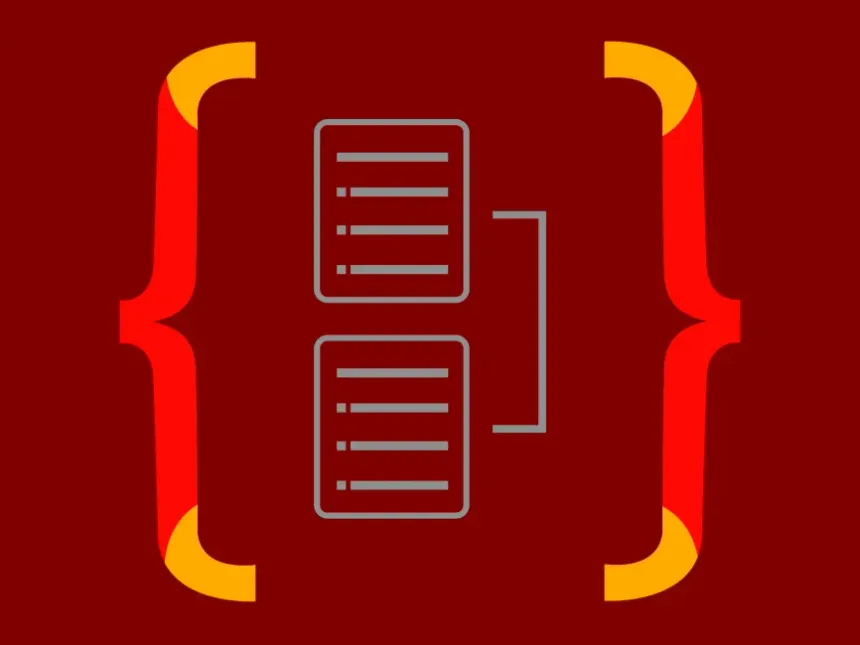

# 📚 REPASO TEÓRICO | TypeORM

[Volver a Inicio](../../README.md)

## 🎯¿Qué es un ORM?

- ORM (Object-Relational Mapping / Mapeo Objeto-Relacional).
- Es una herramienta que permite interactuar con una base de datos relacional utilizando código orientado a objetos, sin necesidad de escribir consultas SQL manualmente.

### ⚙️¿Cómo funciona?

- En nuestra aplicación trabajanos con clases y objetos.
  - Ejemplo: User, Credential, Appointment.
- El ORM mapea esas clases a tablas y sus instancias a registros en la base de datos.
  - Ejemplo: users, credentials, appointments.
- Gracias a ese mapeo, podemos:
  - Crear, leer, actualizar o eliminar datos utilizando métodos y propiedades de objetos, en lugar de escribir SQL.
- El ORM también se encarga de:
  - Convertir los datos devueltos por la base de datos en objetos de JavaScript.
  - Permitiendo trabajar con ellos de forma natural en el lenguaje de nuestra aplicación (JavaScript / TypeScript).

### ⚙️Repository en ORM

- En los ORM, un **"repository"** (repositorio) es un **objeto especializado para interactuar con una entidad específica** de nuestra base de datos, es decir, que tiene incluidos los métodos para hacerlo.
- Es la **forma principal de acceder y manipular datos** sin tener que escribir SQL manualmente.

 

### ✅Ventajas

- Elimina la necesidad de escribir SQL manual.
- Código más legible y alineado con la lógica de negocio.
- Mayor portabilidad entre distintos motores de bases de datos, nosotros escribimos en JavaScript, luego el ORM lo traduce al motor de Base de Datos (PostgreSQL, MariaDB, MySQL, etc).
- Manejo más organizado de:
  - Relaciones
  - Migraciones
  - Esquema de la base de datos

---

## 🎯¿Qué es TypeORM?

- TypeORM es un ORM orientado principalmente a TypeScript, aunque puede utilizarse también con JavaScript.
- Permite trabajar con clases y decoradores para mapear objetos a tablas de una base de datos relacional.
- Funciona en distintos entornos de ejecución como Node.js.

### ⚙️¿Por qué trabajar con TypeORM?

- Ofrece integración con TypeScript.
- Permite trabajar con objetos y clases, sin escribir SQL directamente.
- Es compatible con múltiples gestores de bases de datos relacionales:
  - PostgreSQL
  - MySQL
  - SQLite
  - SQL Server
- Brinda flexibilidad según el tamaño y las necesidades del proyecto.
- Se integra fácilmente con frameworks web como Express (y también NestJS).

### [📄Documentación de TypeORM](https://typeorm.io/)

 

---

[Volver a Inicio](../../README.md)
